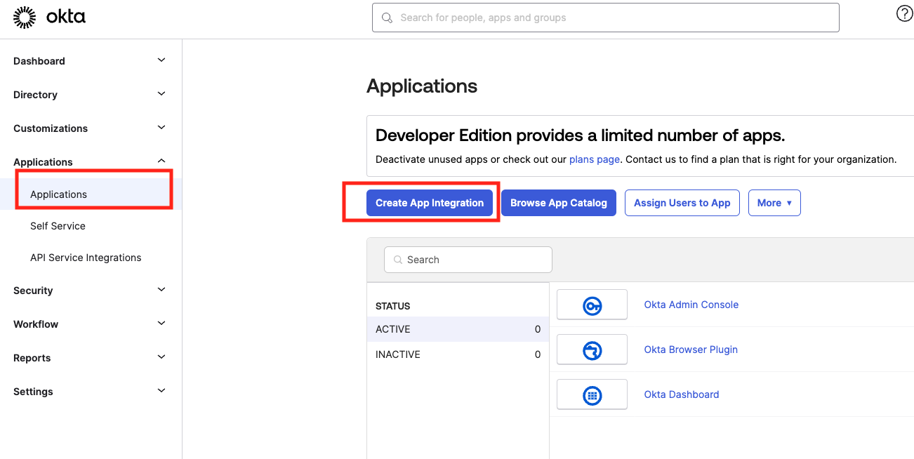
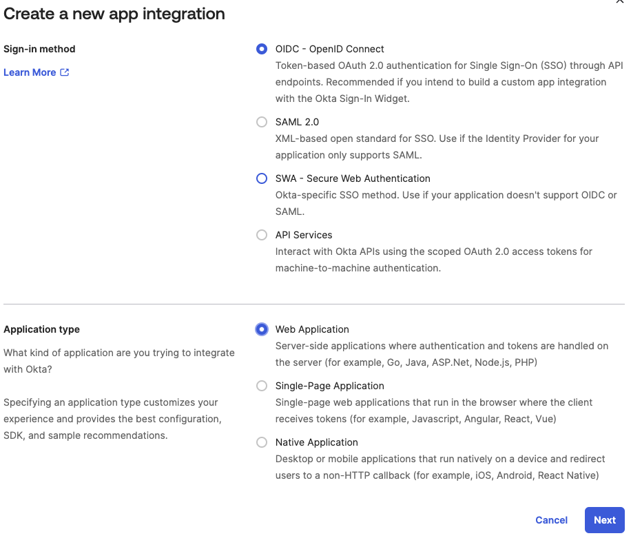
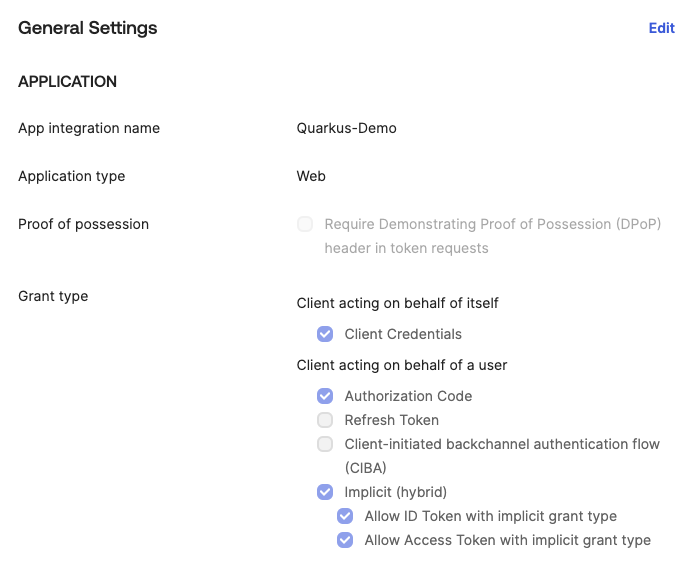
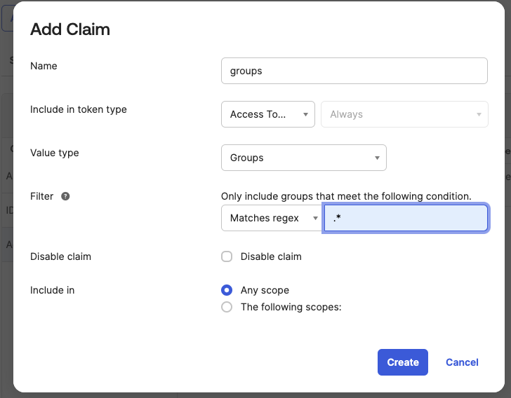
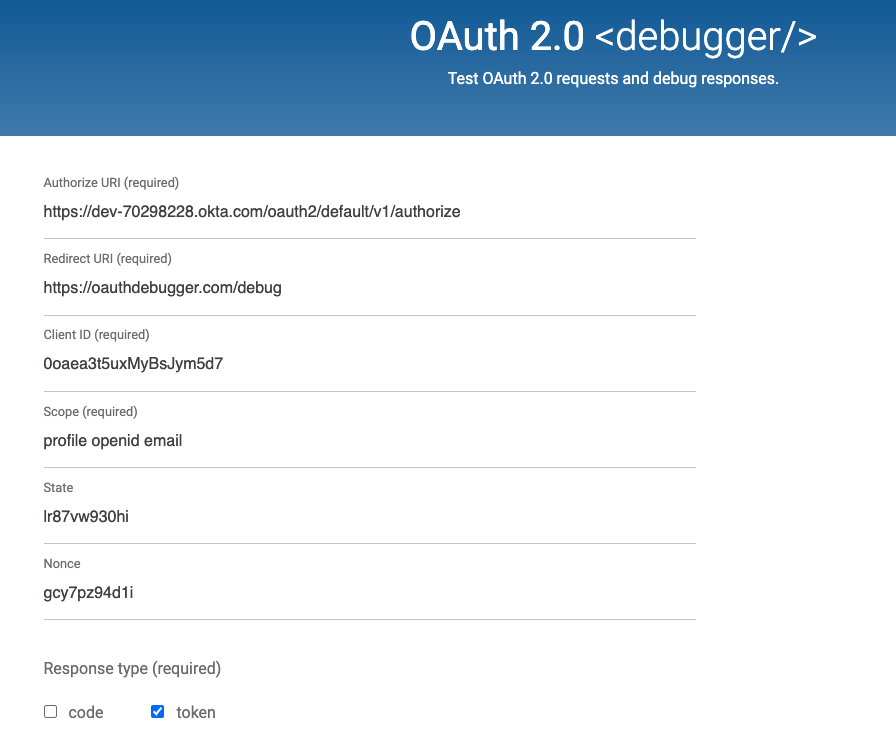

# Create App Okta
Log in to [Okta Dev](https://developer.okta.com/)

* Create an OIDC Application in Okta to Test Your Quarkus Service

* Add People/Groups, assign groups to the application
* Add Claim under Security -> API -> Add Claims

* Get the token using oauth debugger

